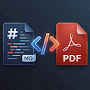

<p align="center">
  
</p>

<h1 align="center">Convert Markdown to PDF</h1>

<p align="center">
  <strong>Beautiful PDFs from Markdown — with diagrams, presentations, and live preview.</strong>
</p>

<p align="center">
  <a href="https://marketplace.visualstudio.com/items?itemName=alvarotech.convert-md-to-pdf"></a>
  <a href="https://marketplace.visualstudio.com/items?itemName=alvarotech.convert-md-to-pdf"></a>
  <a href="https://marketplace.visualstudio.com/items?itemName=alvarotech.convert-md-to-pdf"></a>
  <a href="https://github.com/tiveor/convert-md-to-pdf/blob/main/LICENSE"></a>
  <a href="https://github.com/tiveor/convert-md-to-pdf"></a>
</p>

---

A VS Code extension that turns Markdown into polished, print-ready PDFs using Chrome/Chromium. Supports Mermaid diagrams, Excalidraw sketches, Marp slide decks, syntax-highlighted code blocks, and custom CSS themes — all rendered locally.

## Features

- **Export to PDF** — Convert any `.md` file via command palette, editor title bar, or right-click menu (editor and file explorer)
- **Live Preview** — Side-by-side preview panel that re-renders as you type
- **Mermaid Diagrams** — Flowcharts, sequence diagrams, class diagrams, and all Mermaid types rendered via CDN (v11)
- **Excalidraw Sketches** — Hand-drawn style SVGs from ` ```excalidraw ` JSON blocks
- **Marp Presentations** — Auto-detects `marp: true` front matter and prompts to export as a slide deck PDF (1280x720 per slide) or a regular document PDF
- **Diagram Themes** — 5 built-in color themes for Mermaid diagrams; inline `style` directives are stripped so the theme always applies uniformly
- **Page Orientation Picker** — When diagrams are detected, prompts to choose Auto, Portrait, or Landscape
- **Syntax Highlighting** — Code blocks highlighted with highlight.js using a GitHub-inspired theme
- **Custom CSS** — Apply your own stylesheet (absolute path or relative to workspace root)
- **Configurable** — Page size, margins, font size, headers, footers, and Chrome path

## Commands

| Command | Description |
|---|---|
| `Export Markdown to PDF` | Export the active `.md` file to PDF. Prompts for orientation when diagrams are detected. |
| `Open PDF Preview` | Open a live preview panel beside the editor. |
| `Export Markdown to Presentation PDF` | Export as a Marp slide deck PDF (also triggered automatically when `marp: true` is detected during regular export). |

All three commands are available from:
- **Command Palette** (`Cmd+Shift+P` / `Ctrl+Shift+P`)
- **Editor title bar** icons (when a `.md` file is open)
- **Right-click context menu** in the editor or file explorer

## Quick Start

1. Install from the [VS Code Marketplace](https://marketplace.visualstudio.com/items?itemName=alvarotech.convert-md-to-pdf)
2. Open any `.md` file
3. `Cmd+Shift+P` &rarr; **Export Markdown to PDF**
4. Choose where to save — done!

## Diagram Themes

Set `convertMdToPdf.diagramTheme` in your VS Code settings:

| Theme | Style |
|-------|-------|
| `ocean` | Blue tones — clean and professional **(default)** |
| `forest` | Green tones — natural and fresh |
| `rose` | Pink/purple tones — warm and modern |
| `slate` | Gray tones — minimal and neutral |
| `sunset` | Orange/amber tones — warm and energetic |

Themes control node fill, border, text color, connector lines, cluster backgrounds, and edge labels across all Mermaid diagram types.

## Settings

All settings are under the `convertMdToPdf.*` namespace.

| Setting | Default | Description |
|---|---|---|
| `chromePath` | Auto-detect | Path to Chrome/Chromium executable. Auto-detected on macOS, Windows, and Linux. |
| `pageSize` | `A4` | Page size: `A4`, `Letter`, `Legal`, `Tabloid` |
| `orientation` | `auto` | Page orientation: `auto`, `portrait`, `landscape` |
| `margins` | `{ top: 20mm, bottom: 20mm, left: 15mm, right: 15mm }` | Page margins (supports `mm`, `cm`, `in`, or `px`) |
| `fontSize` | `14` | Base font size in pixels |
| `diagramTheme` | `ocean` | Mermaid diagram theme: `ocean`, `forest`, `rose`, `slate`, `sunset` |
| `customCssPath` | — | Path to a custom CSS file (absolute, or relative to workspace root) |
| `headerTemplate` | — | HTML template for page headers ([Puppeteer classes](https://pptr.dev/api/puppeteer.pdfoptions#headertemplate)) |
| `footerTemplate` | Page numbers | HTML template for page footers. Default: `<span class="pageNumber"></span> / <span class="totalPages"></span>` |

## How It Works

1. Markdown is parsed with [markdown-it](https://github.com/markdown-it/markdown-it) (HTML, linkify, typographer enabled)
2. YAML front matter is stripped before rendering
3. Code blocks are syntax-highlighted with [highlight.js](https://highlightjs.org/)
4. ` ```mermaid ` and ` ```excalidraw ` blocks are converted to renderable containers
5. The HTML is loaded in a headless Chrome instance via [Puppeteer](https://pptr.dev/)
6. Mermaid (v11 CDN) and Excalidraw render diagrams client-side in the browser
7. Diagrams are auto-scaled to fit the page — large diagrams are split across pages when needed
8. Chrome prints to PDF with the configured page size, margins, and orientation

## Requirements

- [Google Chrome](https://www.google.com/chrome/) or any Chromium-based browser (Edge, Brave, etc.)
- Auto-detected on macOS, Windows, and Linux — or set the path manually via `convertMdToPdf.chromePath`

## Contributing

Contributions, issues, and feature requests are welcome!

```bash
git clone https://github.com/tiveor/convert-md-to-pdf.git
cd convert-md-to-pdf
pnpm install
pnpm dev          # watch mode with hot reload
# Press F5 in VS Code to launch the Extension Development Host
pnpm build        # production build
pnpm package      # create .vsix package
```

## License

[MIT](LICENSE) &copy; [Alvaro Orellana](https://github.com/tiveor)
