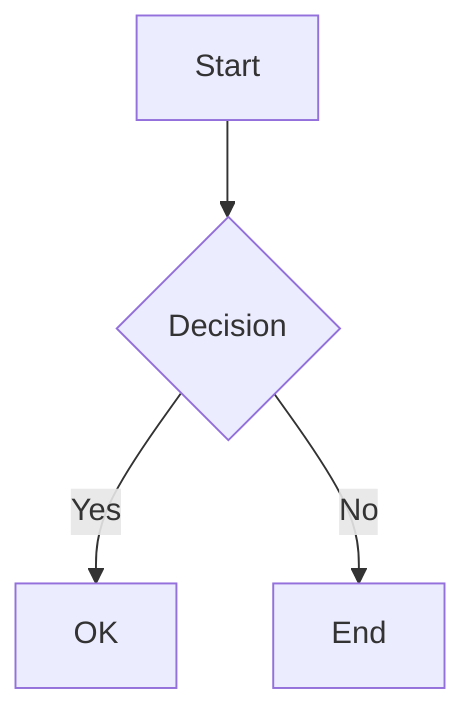
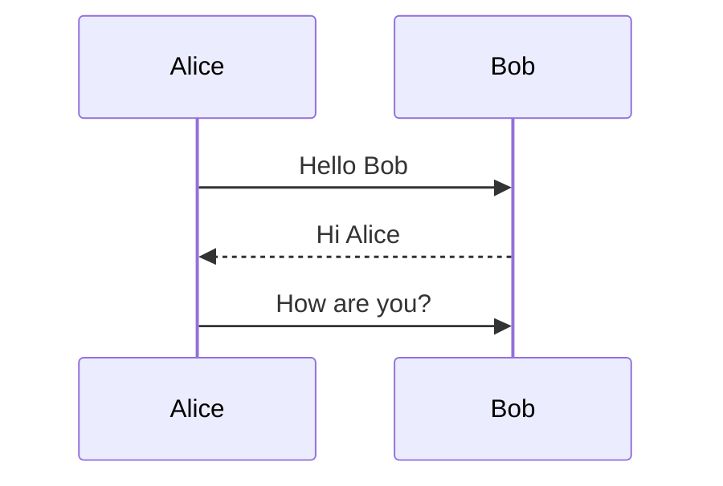
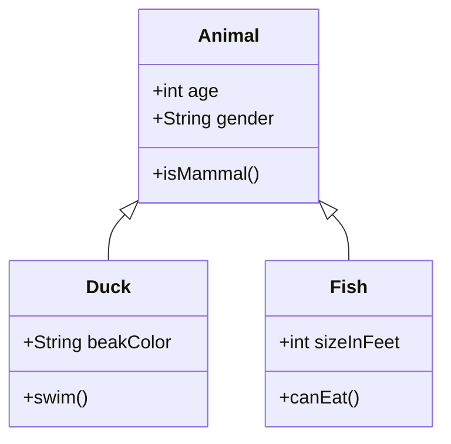

# Mermaid Test

## Flowchart



## Sequence Diagram



## Class Diagram



## Regular code block (should still highlight)

```js
console.log("this should still highlight normally");
```

## Plain text

This is a normal paragraph to verify regular markdown still works.
